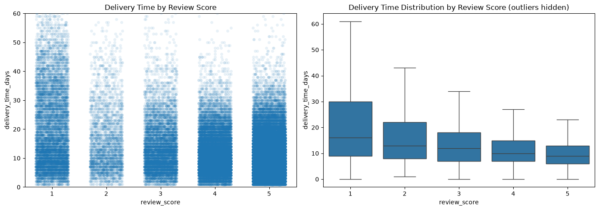
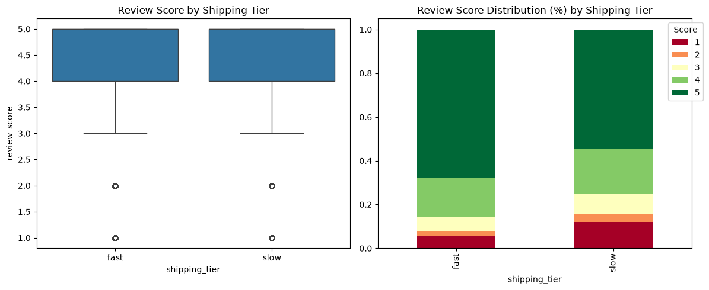
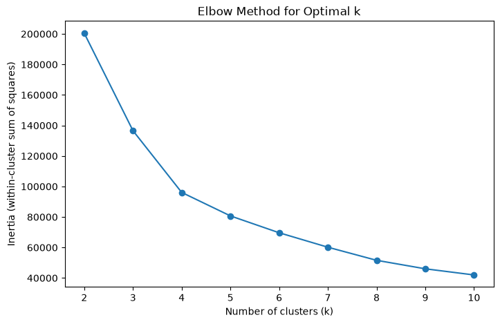
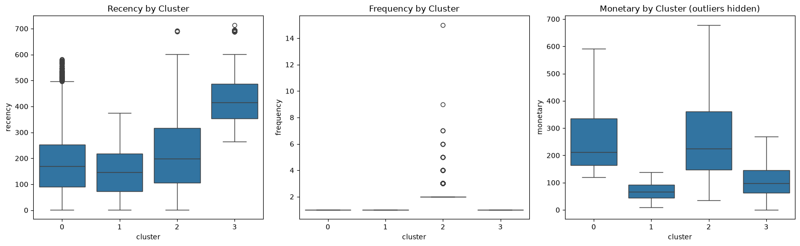
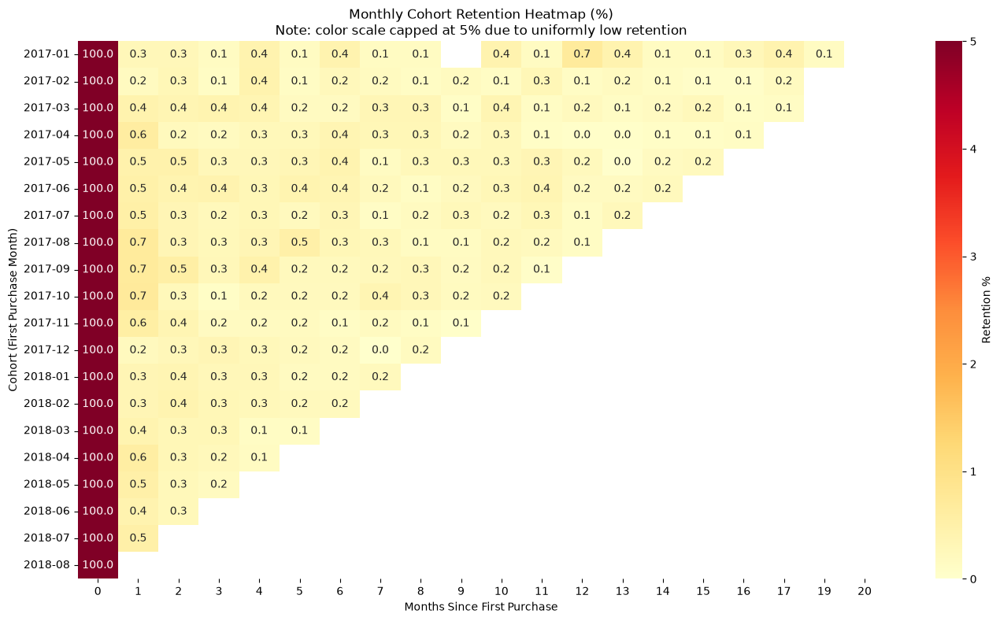
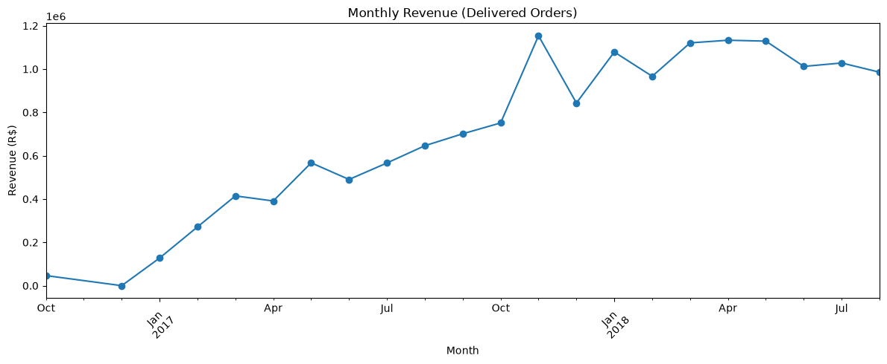
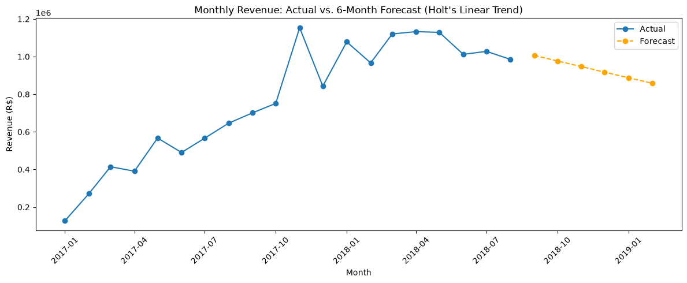

# Olist Statistical & Data Science Deep Dive

A statistical and data science follow-up to my [Olist E-Commerce BI Pipeline](https://github.com/Nkanyisogwane/olist-ecommerce-bi-pipeline) project, using the same cleaned dataset to demonstrate hypothesis testing, experimental design thinking, customer segmentation, cohort analysis, and time series forecasting.

**This project is explicitly AI-assisted.** I worked through each phase using Claude as a step-by-step guide — writing prompts, reviewing generated code, running it, interpreting output, and making the judgment calls (which test to trust, which model to reject, how to frame findings honestly). The goal was to demonstrate that I can direct and critically evaluate AI-assisted analytical work, not just produce polished output. Where a result looked too good, too clean, or potentially misleading, I've documented that explicitly rather than hiding it.

## Dataset

[Brazilian E-Commerce Public Dataset by Olist](https://www.kaggle.com/datasets/olistbr/brazilian-ecommerce) (~100K orders, 2016–2018). Cleaned data is reused from my BI Pipeline project rather than re-cleaned here — see `clean_data/README.md` for details.

## Project Structure

```
olist-statistical-deep-dive/
├── olist_stats_deepdive.ipynb   # Full analysis notebook
├── clean_data/                  # See clean_data/README.md
├── images/                      # Exported chart images
├── requirements.txt
└── README.md
```

## Environment

- Python 3.14, Jupyter Notebook
- Core packages: pandas, numpy, scipy, scikit-learn, statsmodels, matplotlib, seaborn
- See `requirements.txt` for exact versions

To reproduce: `pip install -r requirements.txt`, then run `olist_stats_deepdive.ipynb`.

## Analysis Phases

### Phase 1 — Statistical Validation
Formalized the delivery-speed vs. review-score relationship with Pearson and Spearman correlation, one-way ANOVA, and Kruskal-Wallis testing across review score groups. Levene's test confirmed unequal variances between groups, formally justifying Kruskal-Wallis as the more trustworthy test over ANOVA.

**Key finding:** Moderate negative correlation (Pearson r = -0.33, p < 0.001) between delivery time and review score. Delivery speed matters to satisfaction but explains only ~11% of variance — it's a real driver, not the dominant one.



### Phase 2 — A/B Testing Simulation
Simulated a fast (≤7 days) vs. slow (>7 days) shipping comparison using Welch's t-test, explicitly framed as an **observational natural experiment**, not a true randomized controlled trial — Olist customers were never randomly assigned to shipping speed.

**Key finding:** Statistically significant difference in review scores (t = 48.57, p < 0.001) with a small-to-moderate effect size (Cohen's d = 0.32). Causal language avoided in favor of associational framing given the observational design.



### Phase 3 — Customer Segmentation (RFM + K-Means)
Built Recency-Frequency-Monetary scores per unique customer, then applied K-Means clustering. k=4 was selected via silhouette score — notably *not* the highest-scoring option (k=2 scored higher but was rejected as trivial, merely re-detecting the dataset's dominant one-time-vs-repeat-buyer split).

**Key finding:** 97% of customers made only one purchase — a structural feature of Olist's multi-seller marketplace model, not a data quality issue. Four segments identified: Recent High-Spenders, Recent Low-Spenders, Repeat Customers (only 3% of the base, but comparable spend to top one-time buyers), and Dormant/Lapsed customers.





### Phase 4 — Cohort Analysis
Tracked monthly first-purchase cohorts (Jan 2017 – Aug 2018) to see whether platform-level retention varied over time.

**Key finding:** Month-1 retention stays below 1% for every cohort, with no cohort meaningfully outperforming another. This confirms Phase 3's finding at a month-by-month level — retention is a structurally flat, low floor across the entire observed period, not something specific cohorts solved better than others.



### Phase 5 (Stretch) — Light Forecasting
Applied Holt's linear trend exponential smoothing to 20 months of monthly revenue. ARIMA/SARIMA was considered and rejected — insufficient history to reliably estimate seasonal terms, despite a visible Black Friday spike (Nov 2017) that a non-seasonal model can't capture.

**Key finding:** The model forecasts a gradual revenue decline, but this appears to be over-extrapolating a short Jun–Aug 2018 dip rather than detecting genuine decline (the broader Mar–Aug pattern looks more like a plateau). This phase is presented as a demonstration of the method and its limitations on short series, not a production-grade forecast — no train-test holdout validation was possible given the limited data.




## Key Takeaways

- Statistical significance and practical/effect-size significance are reported and interpreted separately throughout — a large sample size (~96K rows) makes almost everything "significant," so effect sizes (Cohen's d, r²) are used to judge real-world importance.
- Every phase includes an honest look at its own limitations: observational vs. experimental framing (Phase 2), a rejected "best" cluster count in favor of a more useful one (Phase 3), and a forecast flagged as likely unreliable rather than presented at face value (Phase 5).
- Data completeness was actively verified rather than assumed — e.g., checking order volume before trusting the final month of the revenue series in Phase 5.

## Related Work

- [Olist E-Commerce BI Pipeline](https://github.com/Nkanyisogwane/olist-ecommerce-bi-pipeline) — Python cleaning → SQL Server star schema → Power BI dashboard (the source of the cleaned data used here)
